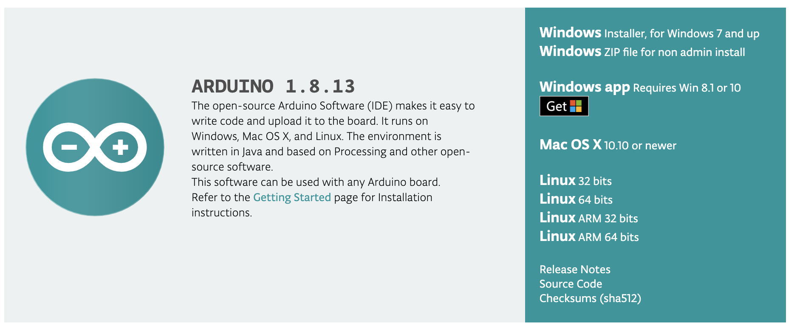
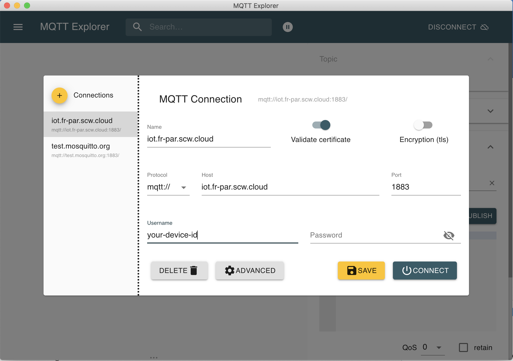

# Get started with the ESP32 cam module and store pictures in the Cloud

In this tutorial, we will see how to take a picture publishing a message on a `SMILE` topic and forward this message to a S3-compatible Object Storage bucket.


To do this, we will be using the default example code for the esp32 camera module which will be slightly modified to add the MQTT compatibility.

## Material


Get the boards:

* [Aliexpress](https://fr.aliexpress.com/item/1005001900359624.html)
* [Amazon](https://www.amazon.fr/diymore-d%C3%A9veloppement-Bluetooth-ESP32-CAM-MB-Dual-core/dp/B08P1NMPLL)

The external antenna is optional but will give you a better Wifi coverage.

## Prerequisties

- Having a [Scaleway account](https://console.scaleway.com/)
- Download or clone this repository: [https://github.com/luisomoreau/ESP32-cam-MQTT](https://github.com/luisomoreau/ESP32-cam-MQTT)
- Download and install the Arduino IDE: [https://www.arduino.cc/en/main/software](https://www.arduino.cc/en/main/software)




## Setting up your developer environment

Open Arduino preferences:


and add the board `https://dl.espressif.com/dl/package_esp32_index.json` as followed:


Go to your board manager:


And add the offical Espressif boards:


Select the AI Thinker ESP32-CAM:


## Creating the message broker (IoT Hub) and provision the devices

Go to the [IoT Hub](https://console.scaleway.com/iot-hub/hubs) tab in the Scaleway's console:


Create your first Hub and choose the `Free SHARED` Plan:


Click on `create and add a device`, your hub will be ready in few seconds.

### Adding a device

In this tutorial, we will add two distinguish devices: The **camera** itself, which be be our ESP32 cam hardware, and the **MQTT explorer**, which is a software that we will be using to trigger the camera and to view the payloads that are going through our Hub.


Please, for this tutorial, choose `Allow unsecure connections` so we can easily connect our devices to our hub.


Finally, add another device that will be called `mqtt-explorer`:


Once done, we will download MQTT Explorer and test the connection. 

### MQTT Explorer

MQTT Explorer is a comprehensive MQTT client that provides a structured overview of your MQTT topics and makes working with devices/services on your broker dead-simple.

To install a lightweight MQTT, just download it here: [mqtt-explorer.com](http://mqtt-explorer.com/)

Open MQTT Explorer and fill the following information:

Host: `iot.fr-par.scw.cloud`

Username: `your-device-id` (the Device ID can be found on the overview tab when clicking on a device, see below)




Click on Connect, you should see the following screen:

 

## Create an Object Storage bucket

To create an object storage bucket to store our pictures, navigate under the [Object Storage tab](https://console.scaleway.com/object-storage/buckets) and click on `+ create a bucket`:


Give a name to your bucket and select a region :


Click on `Create a bucket` and you are done.

## Setting up an IoT Route

The IoT Routes allow your IoT Hub to forward messages to non-MQTT destinations. In this project, we will use the [Object Storage Route](https://www.scaleway.com/en/docs/scaleway-iothub-route/#-Scaleway-Object-Storage-Route/).

Go back to your [IoT Hub](https://console.scaleway.com/iot-hub/hubs) tab, select your hub and click on `Routes`:


Once done, your cloud environment is all set. It is time to program our ESP32 cam module

## ESP32 Cam Programm

You can either start with the `CameraWeServer` example sketch and add modify the code or open the `SCW_Photobooth` sketch in [this Github repository](https://github.com/luisomoreau/ESP32-cam-MQTT).


If you choose to open the `SCW_Photobooth.ino` sketch, you just need to modify the following variable to make it work (the `mqttUser` being your Scaleway `Device ID`):

```
//WIFI config
const char* ssid = "your-ssid";
const char* password = "your-passord";

//MQTT config
bool useMQTT = true;
const char* mqttServer = "iot.fr-par.scw.cloud";
const char* HostName = "Photobooth_Scaleway";
const char* mqttUser = "your-device-id";
const char* mqttPassword = "";
const char* topic_PHOTO = "SMILE";
const char* topic_PUBLISH = "PICTURE";
const char* topic_FLASH = "FLASH";
const int MAX_PAYLOAD = 60000; // Maximum payload size to be sent using MQTT (in Bytes)
```

And do not forget to add the PubSubClient library:


You will fin this library under the library folder in the Github repository.

Now you can connect your board, select the port and uplaod the sketch. Then open the Serial console and the MQTT explorer client:


On the MQTT Explorer client, you can send an empty payload under the `SMILE` topic. Click on `PUBLISH` and your camera will take a picture and publish it under the `PICTURE` topic.

To see your pictures, you can go back to your [Object Storage bucket](https://console.scaleway.com/object-storage/buckets) in the Scaleway console. You should see your pictures being populated as you take new pictures.


## Going further

The default `CameraWebServer` also provides a web interface to take pictures and change settings. I slightly modified the `app_httpd.cpp` code to also send the picture when captured using the web interface.

To open the web interface just copy past the local IP provided by the Serial console. Click on `Get still` at the bottom left corner. Once taken, the picture will be publish under the `PICTURE` MQTT topic and then forwarded to your Object Storage bucket!


## Ressources

Here is some interesting readings if you'd like to deep dive into the subject:

* [https://randomnerdtutorials.com/upload-code-esp32-cam-mb-usb/](https://randomnerdtutorials.com/upload-code-esp32-cam-mb-usb/)
* [https://github.com/easytarget/esp32-cam-webserver](https://github.com/easytarget/esp32-cam-webserver): More advance code that can be easily modified (including the html part)
* [ESP32 CAM Face Recognition With MQTT Support](https://www.instructables.com/ESP32-CAM-Face-Recognition-With-MQTT-Support-AI-Th/)