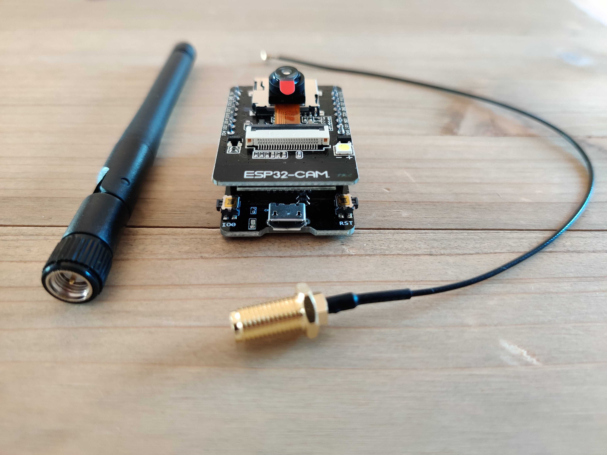

# Get started with the ESP32 cam module and store pictures in the Cloud

## Material



Get the boards:

* [Aliexpress](https://fr.aliexpress.com/item/1005001900359624.html)
* [Amazon](https://www.amazon.fr/diymore-d%C3%A9veloppement-Bluetooth-ESP32-CAM-MB-Dual-core/dp/B08P1NMPLL)

The external antenna is optional but will give you a better Wifi coverage


## Setting up environment

Open Arduino preferences and add the board:

```
https://dl.espressif.com/dl/package_esp32_index.json
```


Go to your board manager:


And add the offical Espressif boards:


Select the AI Thinker ESP32-CAM:

